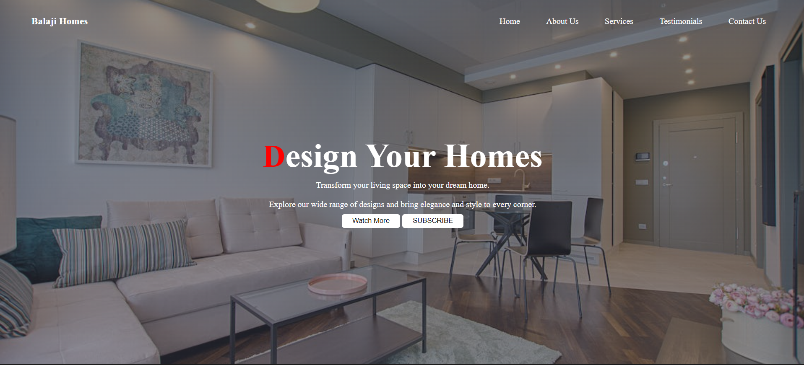

# Home_interior_portal

This is a simple website for exploring home interior designs.

## Description

This project is a static website built using HTML and CSS. It showcases various sections such as home, about, services, testimonials, and contact us. Additionally, it includes a section for viewing living room designs.

## Preview

## Features

- Responsive design
- Navigation menu
- Section for living room designs

## Usage

Simply open `index.html` in your web browser to view the website.

## Contributing

Pull requests are welcome. For major changes, please open an issue first to discuss what you would like to change.

## License

This project is licensed under the MIT License - see the [LICENSE](LICENSE) file for details.
